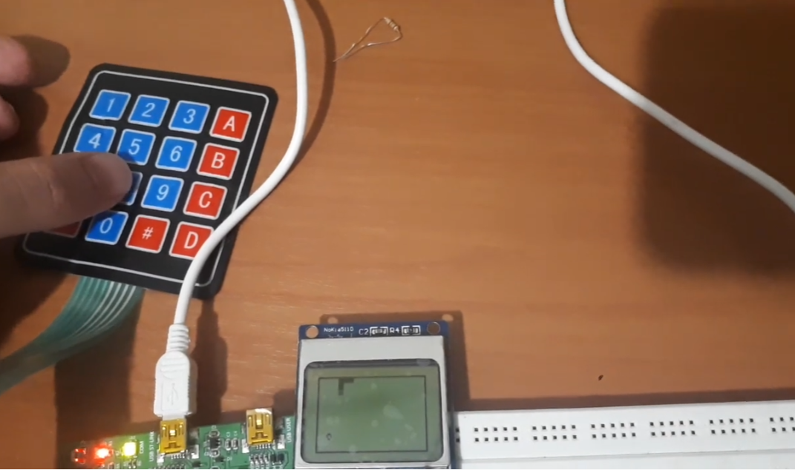

# Snake Game on STM32

This is the classic snake game on an STM32F303VC6 microcontroller. A 4x4 matrix keypad functions as the input and (ironically) a Nokia 5110 display functions as the output screen.

## Circuit description and picture
Pins D8-D11 are used as EXTI interrupt inputs and D12-D15 as GPIO outputs. This way every time a key on the matrix keypad is pressed, we'll have an interrupt that tells us which column it was as well, and then a 1 is shifted between the 4 output pins to discern which row it was.
The LCD works with SPI.

## To Do
The memory usage is not optimized. The game grid itself takes 252 KB of SRAM and the LCD buffer takes 4032 KB of ram which is a lot. 

I will try to optimize the memory usage by using bitwise operations instead of arrays for the game grid, and I will also try to improve the 5110 LCD library, [which you can find on my own github](https://github.com/alireza-tabatabaee/STM32-HAL-Nokia-5110-library).

## License
[GPL 3.0](https://choosealicense.com/licenses/gpl-3.0/)
